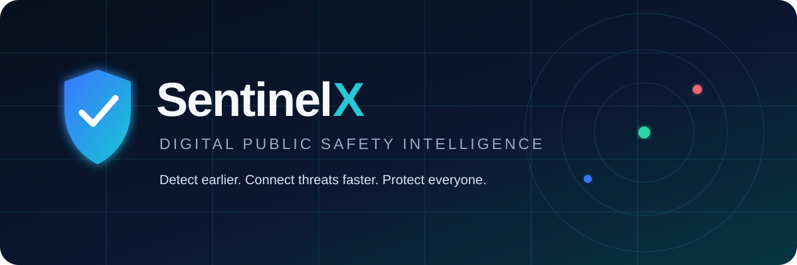
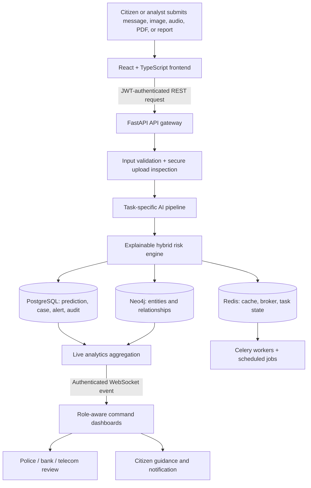
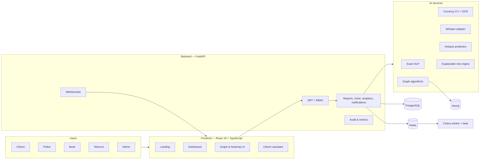

<h1 align="center">SentinelX</h1>

<p align="center">
  
</p>

<p align="center">
  <strong>Detect earlier. Connect threats faster. Protect everyone.</strong>
</p>

<p align="center">
  An explainable, full-stack intelligence platform for detecting digital-arrest scams,<br/>
  counterfeit currency, coordinated fraud networks, and emerging cybercrime hotspots.
</p>

<p align="center">
  <a href="https://github.com/Sona30k/SecureSight-AI/actions"></a>
  <a href="https://www.python.org/"></a>
  <a href="https://fastapi.tiangolo.com/"></a>
  <a href="https://react.dev/"></a>
  <a href="https://www.typescriptlang.org/"></a>
</p>

<p align="center">
  <a href="https://www.postgresql.org/"></a>
  <a href="https://neo4j.com/"></a>
  <a href="https://redis.io/"></a>
  <a href="https://www.docker.com/"></a>
  <a href="LICENSE"></a>
  <a href="https://github.com/Sona30k/SecureSight-AI/stargazers"></a>
</p>

> [!IMPORTANT]
> SentinelX is a hackathon and research prototype built with synthetic data. It is not a replacement for emergency services, law-enforcement judgment, bank verification, or forensic analysis. Do not use prototype predictions as the sole basis for legal or financial action.

## 🌐 Project overview

**SentinelX** is an AI-powered Digital Public Safety Intelligence Platform designed for citizens, police, banks, telecom providers, and public-sector administrators. It brings fragmented safety signals—suspicious calls, messages, uploaded currency images, complaints, transactions, devices, accounts, and locations—into one explainable intelligence workspace.

The project was motivated by a simple operational gap: modern fraud moves across channels and organizations, while most defenses remain isolated. A scam call may use a spoofed phone number, move money through several UPI IDs, reuse a known device, and target citizens in a rising geographic cluster. If each signal is reviewed separately, the pattern appears only after harm occurs. SentinelX connects those signals early enough to support prevention.

AI changes this workflow by helping teams triage volume, surface relationships, identify coercive language, inspect visual security features, and rank risk consistently. SentinelX keeps that assistance transparent: every prediction includes a score, confidence, model version, and human-readable contributing factors. The platform is designed around **human oversight**, not autonomous enforcement.

## 🚨 Problem statement

### Digital-arrest scams

Fraudsters impersonate police, courts, customs officials, banks, or investigative agencies. Victims are pressured to remain on a call, isolate themselves, disclose credentials, or transfer funds into a so-called verification account. The combination of authority, fear, urgency, video calls, spoofed numbers, and financial demands makes these attacks unusually coercive.

### Counterfeit currency circulation

Manual note inspection is slow and inconsistent at scale. Banks, merchants, and investigators need a repeatable way to examine security-thread visibility, watermarks, serial-number patterns, print quality, and other visual signals while preserving a reviewable result.

### Organized fraud rings

Fraud rarely involves a single identity. Phone numbers, devices, IP addresses, bank accounts, UPI handles, citizens, complaints, and transactions form networks. Traditional row-based tools make multi-hop relationships difficult to see, allowing shared infrastructure and high-centrality actors to remain hidden.

### Rapid cybercrime growth

Attack methods evolve faster than static blacklists. Campaigns can shift geography, language, accounts, and communication platforms in hours. Existing solutions are often reactive: they record an incident after a loss, investigate one case at a time, and rarely share intelligence across organizational boundaries.

SentinelX introduces a proactive layer. It scores suspicious interactions before action is taken, links recurring entities, predicts emerging hotspots, creates risk alerts, and distributes live updates to role-specific dashboards.

## ✨ Key features

| Capability | What SentinelX provides |
|---|---|
| ✅ Digital Arrest Detection | Hybrid transcript analysis combining scam language, spoofing, duration, video-call pressure, and previous reports |
| ✅ Counterfeit Detection | Secure image ingestion, visual feature inspection, authenticity prediction, confidence, and evidence metadata |
| ✅ Fraud Network Analysis | Neo4j-ready entity graph plus NetworkX PageRank, centrality, community detection, clusters, and high-risk nodes |
| ✅ Crime Heatmaps | GeoJSON incident data, district filtering, ranked hotspots, and prediction-ready geospatial outputs |
| ✅ AI Citizen Assistant | Text, image, voice, and PDF-aware safety guidance with modular provider architecture |
| ✅ OCR | Serial number, denomination, signature indicator, and text extraction through an EasyOCR-compatible pipeline |
| ✅ Voice Analysis | Whisper-compatible transcription followed by scam classification and risk scoring |
| ✅ Hybrid Risk Engine | Weighted scam, counterfeit, graph, location, and history signals normalized to a 0–100 score |
| ✅ Explainable AI | Ranked features, confidence, model version, risk level, and plain-language recommendations |
| ✅ Live Command Center | Database-backed metrics, reports, charts, district rankings, activities, and risk distribution |
| ✅ Real-Time Alerts | Authenticated WebSocket channels for dashboard, alert, report, graph, and heatmap updates |
| ✅ Role-Based Access | Citizen, police, bank, telecom-provider, and administrator permissions in both API and UI |
| ✅ Interactive Graphs | Clickable risk-scored entities and relationship visualization |
| ✅ Evidence Trail | Persistent AI analyses, request ownership, timestamps, audit logs, and stored upload references |
| ✅ Analytics | Fraud trends, protected funds, active investigations, counterfeit alerts, and high-risk call counts |

## 🔄 Complete workflow



1. **Submission** — A citizen or authorized analyst submits suspicious text, a call transcript, an image, audio, a PDF, a fraud report, or geospatial incident data.
2. **Secure intake** — The React interface sends the request through a centralized Axios client. Access tokens are refreshed automatically through a single-flight refresh flow.
3. **Validation** — FastAPI and Pydantic validate sizes, field ranges, roles, and request shapes. Image signatures are inspected rather than trusting browser-provided MIME types.
4. **AI analysis** — The relevant independent pipeline processes the content: language classification, currency vision, OCR, voice transcription, graph analysis, or hotspot scoring.
5. **Risk fusion** — The risk engine combines model and contextual signals into a normalized score and Low, Medium, High, or Critical classification.
6. **Persistence** — The platform stores the case, prediction, confidence, model version, processing time, request owner, and audit event in PostgreSQL.
7. **Relationship intelligence** — Where applicable, phones, devices, accounts, UPI IDs, IPs, complaints, and transactions are linked in Neo4j-compatible graph structures.
8. **Operational update** — Analytics queries aggregate current cases. WebSocket events refresh relevant dashboards without waiting for manual reloads.
9. **Human action** — Authorized users investigate, verify, notify, or resolve the case. Citizens receive safety-first guidance rather than an opaque model verdict.

## 🏗️ System architecture



## 🧠 AI modules

<details>
<summary><strong>Digital Arrest Scam Detection</strong></summary>

The scam pipeline normalizes transcripts, extracts authority, urgency, financial, and coercion features, and detects phrases such as “digital arrest,” “verification account,” or “do not disconnect.” Its portable baseline is deterministic and explainable; a saved IndicBERT or multilingual DistilBERT classifier can be plugged in through the same inference contract. Audio enters through a Whisper-compatible transcription adapter before classification.
</details>

<details>
<summary><strong>Counterfeit Currency, Computer Vision, and OCR</strong></summary>

The currency pipeline inspects image quality and security signals including thread visibility, watermark indicators, and serial validity. It supports future YOLOv8 or ResNet checkpoints without changing the API. EasyOCR is an optional provider for serial number, denomination, signature indicator, and text extraction. Synthetic augmentation utilities generate brightness, rotation, blur, noise, contrast, crop, and compression variants.
</details>

<details>
<summary><strong>Fraud Network Intelligence</strong></summary>

Graph data models citizens, phones, devices, bank accounts, UPI IDs, IP addresses, complaints, and transactions. NetworkX provides PageRank, degree centrality, shortest paths, modularity communities, cluster detection, and visualization JSON. Neo4j is the persistent graph adapter for multi-hop investigations.
</details>

<details>
<summary><strong>Crime Hotspot Prediction</strong></summary>

The geospatial module works with synthetic GeoJSON incidents containing coordinates, district, crime type, timestamp, and risk. A Random Forest baseline is included, while XGBoost, GeoPandas, Folium, PostGIS, or production map tiles can be introduced later. Predictions explain incident density, district history, and temporal patterns.
</details>

<details>
<summary><strong>Hybrid Risk and Explainable AI</strong></summary>

The hybrid engine combines scam score, counterfeit score, graph score, location risk, and previous reports. Each weighted contribution is retained. SHAP is supported when a compatible trained model is available; the portable fallback produces deterministic feature contributions such as “Spoofed caller number,” “Repeated scam keywords,” “Known fraud device,” or “High-risk district.”
</details>

## 📁 Repository structure

```text
SecureSight-AI/
├── src/                         # React UI, auth context, API client, hooks
│   ├── lib/api.ts               # Axios, refresh, retries, typed services
│   └── test/                    # Vitest and Testing Library tests
├── docker/                      # Frontend image and Nginx reverse proxy
├── docs/assets/                 # GitHub visual assets
├── backend/
│   ├── app/
│   │   ├── api/v1/              # Versioned domain routers
│   │   ├── auth/                # JWT, scrypt passwords, RBAC
│   │   ├── database/            # Async SQLAlchemy sessions
│   │   ├── models/              # Relational domain models
│   │   ├── schemas/             # Pydantic v2 contracts
│   │   ├── services/            # Domain and persistence services
│   │   ├── graph/               # Neo4j adapter
│   │   ├── realtime/            # Authenticated WebSocket hub
│   │   ├── tasks/               # Celery application and tasks
│   │   └── main.py              # FastAPI application
│   ├── ai/
│   │   ├── datasets/            # Generated CSV, JSON, and GeoJSON
│   │   ├── inference/           # Replaceable prediction pipelines
│   │   ├── preprocessing/       # Text, image, and audio preparation
│   │   ├── explainability/      # Feature and SHAP adapters
│   │   ├── synthetic_data/      # Reproducible data generators
│   │   ├── training/            # Baseline and optional model training
│   │   └── artifacts/           # Prototype model artifacts and metrics
│   ├── alembic/                 # Database migrations
│   ├── scripts/                 # Startup and idempotent demo seeding
│   ├── tests/                   # API, AI, integration, and security tests
│   └── docker-compose.yml       # Full local stack
├── CODE_REVIEW.md               # Security and integration review
├── LICENSE
└── README.md
```

## 🛠️ Technology stack

| Layer | Technologies |
|---|---|
| Frontend | React 19, TypeScript 6, Vite 8, React Router, Axios, Framer Motion, Lucide, Recharts |
| Backend | Python 3.12, FastAPI, Pydantic v2, async SQLAlchemy, Alembic, Uvicorn |
| AI/ML | PyTorch-ready pipelines, Transformers, Whisper adapter, YOLO/ResNet adapter, EasyOCR, scikit-learn, XGBoost-ready training, SHAP |
| Data | PostgreSQL, Neo4j, Redis, synthetic CSV/JSON/GeoJSON |
| Processing | Celery worker, Celery Beat, Redis broker/backend, asyncio |
| Visualization | Recharts, interactive SVG graph, GeoJSON heatmap UI, Folium-ready outputs |
| Security | JWT access/refresh tokens, scrypt, RBAC, SlowAPI rate limiting, CORS, security headers |
| DevOps | Docker, Docker Compose, Nginx, health checks, Prometheus metrics, structured JSON logging |
| Testing | Pytest, pytest-asyncio, HTTPX, Vitest, Testing Library, jsdom |

## 🔌 API overview

| Group | Prefix | Purpose |
|---|---|---|
| Authentication | `/auth` | Registration, login, profile, refresh, logout, token revocation |
| Digital Arrest | `/digital-arrest` | Call/transcript analysis and explainable scam risk |
| Counterfeit | `/currency` | Secure note upload and persisted authenticity analysis |
| AI Intelligence | `/ai` | Scam, currency, OCR, voice, graph, hotspot, risk, and chat APIs |
| Fraud Reports | `/reports` | Paginated, searchable, filterable citizen-report lifecycle |
| Crime Intelligence | `/crime` | Incident reporting, GeoJSON heatmap, hotspots, statistics |
| Fraud Graph | `/graph` | Neo4j report creation, networks, clusters, and high-risk entities |
| Analytics | `/analytics` | Dashboard totals, trends, districts, risk distribution, activities |
| Assistant | `/assistant` | Text, image, audio, and PDF safety analysis |
| Notifications | `/notifications` | Email, SMS, push, and WhatsApp-compatible queue/history |
| Platform | `/health`, `/metrics`, `/ws/*` | Service health, Prometheus telemetry, real-time events |

Interactive documentation is available at `/docs` (Swagger UI), `/redoc`, and `/openapi.json` while the API is running.

## 🖼️ Screenshots

| Surface | Preview |
|---|---|
| Landing page | _Add `docs/screenshots/landing.png`_ |
| Command dashboard | _Add `docs/screenshots/dashboard.png`_ |
| Fraud graph | _Add `docs/screenshots/fraud-network.png`_ |
| Crime heatmap | _Add `docs/screenshots/heatmap.png`_ |
| Citizen assistant | _Add `docs/screenshots/assistant.png`_ |
| Counterfeit detection | _Add `docs/screenshots/counterfeit.png`_ |
| Analytics | _Add `docs/screenshots/analytics.png`_ |
| Police dashboard | _Add `docs/screenshots/police.png`_ |
| Citizen application | _Add `docs/screenshots/citizen.png`_ |

## 🎬 Demo

| Resource | Link |
|---|---|
| Live demo | _Deployment URL coming soon_ |
| Demo video | _Video URL coming soon_ |
| Presentation | _Pitch deck URL coming soon_ |
| Architecture PDF | _Architecture document coming soon_ |

### Demo accounts

When `DEMO_MODE=true`, all accounts use password `SentinelX!2026`.

| Role | Email |
|---|---|
| Citizen | `citizen@sentinelx.demo` |
| Police | `police@sentinelx.demo` |
| Bank | `bank@sentinelx.demo` |
| Telecom provider | `telecom@sentinelx.demo` |
| Administrator | `admin@sentinelx.gov.in` |

> [!WARNING]
> Demo mode is rejected by configuration when `ENVIRONMENT=production`. Never publish demo credentials on a production deployment.

## 🚀 Installation

### Prerequisites

- Node.js 22+
- Python 3.12+
- Docker Engine and Docker Compose v2 for the full infrastructure
- Git

### Clone and configure

```bash
git clone https://github.com/Sona30k/SecureSight-AI.git
cd SecureSight-AI
```

### Frontend

```bash
npm ci
npm run dev
```

The development interface runs at `http://localhost:5173`. Set `VITE_API_URL=http://localhost:8000` when using a non-default API address.

### Backend

```bash
cd backend
python3 -m venv .venv
source .venv/bin/activate
pip install -r requirements.txt
cp .env.example .env
alembic upgrade head
python -m scripts.seed
uvicorn app.main:app --reload
```

The API runs at `http://localhost:8000`. For lightweight local development without PostgreSQL, use:

```env
DATABASE_URL=sqlite+aiosqlite:///./sentinelx.db
```

Heavy AI providers are optional:

```bash
pip install -r requirements-ai.txt
python -m ai.synthetic_data.generate
python -m ai.training.train_scam
```

## 🔐 Environment variables

| Variable | Required | Default / example | Description |
|---|---:|---|---|
| `ENVIRONMENT` | Yes | `development` | Runtime mode; production activates stricter checks |
| `SECRET_KEY` | Yes | random 32+ characters | JWT signing secret; never commit the real value |
| `DATABASE_URL` | Yes | PostgreSQL async URL | SQLAlchemy connection string |
| `REDIS_URL` | Recommended | `redis://redis:6379/0` | Cache, Celery broker, and task results |
| `NEO4J_URI` | Recommended | `bolt://neo4j:7687` | Neo4j Bolt endpoint |
| `NEO4J_USER` | Recommended | `neo4j` | Graph database username |
| `NEO4J_PASSWORD` | Recommended | local demo password | Graph database secret |
| `ACCESS_TOKEN_MINUTES` | No | `15` | JWT access-token lifetime |
| `REFRESH_TOKEN_DAYS` | No | `7` | Refresh-token lifetime |
| `CORS_ORIGINS` | Yes | JSON origin list | Explicit trusted browser origins |
| `STORAGE_PATH` | No | `storage` | Local prototype upload location |
| `MAX_UPLOAD_MB` | No | `10` | Currency/OCR image size limit |
| `RATE_LIMIT` | No | `100/minute` | Default per-client API rate limit |
| `DEMO_MODE` | No | `false` | Enables demo-role registration and startup seeding |
| `VITE_API_URL` | Frontend | `http://localhost:8000` | Browser-visible API base URL |
| `WEB_CONCURRENCY` | No | `2` | Uvicorn worker count in container startup |

## 🐳 Running with Docker

```bash
cd backend
cp .env.example .env
docker compose up --build
```

Docker Compose starts:

- React production build behind Nginx on `http://localhost:3000`
- FastAPI on `http://localhost:8000`
- PostgreSQL 16
- Neo4j 5 with Browser on `http://localhost:7474`
- Redis 7
- Celery worker
- Celery Beat

The API container applies Alembic migrations during startup. When demo mode is enabled, it also runs the idempotent seed script. Stop the stack with `docker compose down`; use `docker compose down -v` only when you intentionally want to delete local database volumes.

## 🧪 Synthetic sample datasets

No private, personal, bank, telecom, police, or proprietary government data is included.

| Dataset | Size | Format |
|---|---:|---|
| Scam calls | 5,000 | CSV |
| Fraud reports | 3,000 | CSV |
| Counterfeit cases | 2,000 | CSV |
| Crime locations | 10,000 | GeoJSON |
| Fraud graph | 3,000 nodes across 500 generated networks | JSON |

Regenerate deterministically with:

```bash
cd backend
python -m ai.synthetic_data.generate
```

## 🛡️ Security

- Short-lived JWT access tokens and dedicated refresh tokens
- Token-version revocation on logout
- Server-authoritative RBAC and matching protected frontend routes
- Scrypt password hashing with random per-password salts
- Pydantic request validation and bounded fields
- Rate limiting through SlowAPI middleware
- Explicit CORS allowlist and production configuration validation
- Secure response headers and gzip middleware
- File size, extension, MIME, and binary-signature checks
- Server-generated upload names that prevent path traversal
- Persistent login, report, upload, prediction, profile, and logout audit events
- Generic internal error responses with request IDs

For production, add TLS, a managed secret store, encrypted object storage, antivirus scanning, database encryption, backups, retention rules, and an independent security review.

## 🔍 Explainable AI

SentinelX predictions are intended to be inspectable. The common result contract includes:

```json
{
  "prediction": "Scam",
  "confidence": 98.4,
  "risk_score": 92,
  "explanation": [
    "Spoofed caller number (+24.0)",
    "Repeated scam keywords (+32.0)",
    "Previous fraud reports (+12.0)"
  ],
  "model_version": "explainable-baseline-v1.0",
  "details": {}
}
```

The score does not stand alone. Investigators see contributing features, detected keywords, security checks, or graph metrics. This supports review, comparison, debugging, and future model-governance requirements.

## ⚡ Performance and scalability

SentinelX uses async APIs and database sessions, paginated reports, bounded graph responses, grouped analytics queries, gzip compression, request retry/backoff, vendor chunking, and background workers. Redis supports caching and Celery task state. Authenticated WebSocket channels avoid aggressive dashboard polling.

For larger deployments:

1. Move upload storage to encrypted S3-compatible object storage.
2. Replace the process-local WebSocket hub with Redis pub/sub.
3. Deploy stateless API instances behind a load balancer.
4. Use PostgreSQL read replicas and PostGIS for geospatial clustering.
5. Partition graph workloads and operate a Neo4j cluster.
6. Run model inference as independently autoscaled services.
7. Introduce Kubernetes, centralized observability, autoscaling, and regional disaster recovery.

The architecture can evolve toward microservices, but the current modular monolith keeps the hackathon version understandable and deployable.

## 🧩 Engineering challenges

- **Cross-domain contracts:** NLP, vision, graphs, geospatial data, and reports produce different outputs. A shared prediction contract keeps clients consistent.
- **Explainability:** Safety decisions require reasons, not only classifications. Rule contributions and optional SHAP adapters preserve transparency.
- **Portable AI:** Heavy models complicate demos. Replaceable providers allow deterministic baselines while retaining upgrade paths.
- **Relational and graph data:** PostgreSQL is suited to durable cases and audits; Neo4j is suited to multi-hop relationships. SentinelX defines responsibilities for both.
- **Real-time consistency:** Predictions must update dashboards without losing their audit history. Persistence occurs before WebSocket broadcast.
- **Security versus demo speed:** Demo accounts accelerate evaluation but are prohibited in production configuration.
- **Synthetic realism:** Generated datasets need meaningful patterns without implying real-world model accuracy.

## 💼 Business and public impact

| Stakeholder | Potential value |
|---|---|
| Citizens | Earlier warnings, accessible guidance, safer reporting, and fewer coercive transfers |
| Police | Prioritized cases, connected entities, explainable evidence, and shared operational awareness |
| Banks | Faster counterfeit triage, account-network context, and protected-funds analytics |
| Telecom providers | Scam-number intelligence, spoofing context, and coordinated campaign visibility |
| Government agencies | Cross-sector trend analysis, hotspot awareness, auditable AI assistance, and policy insight |

## 💡 What makes SentinelX different?

SentinelX is not only a classifier and not only a dashboard. It combines multimodal intake, explainable AI, graph intelligence, geospatial prediction, case persistence, role-aware operations, real-time updates, and citizen guidance in one coherent workflow. Its replaceable-provider design avoids locking the platform to one model vendor. Its synthetic-first approach makes the project reproducible and safe to demonstrate. Most importantly, it treats AI as an intelligence assistant whose reasoning must remain visible to humans.

## 🗺️ Future enhancements

- Deepfake and synthetic-voice detection
- Consent-aware telecom scam-call feeds
- Bank and UPI risk-provider integrations
- Cryptographically verifiable evidence chain
- Multilingual Indic speech and text calibration
- Production PostGIS heatmaps and map clustering
- Privacy-preserving cross-agency federation
- National-scale threat intelligence exchange
- Automated model drift, bias, and calibration monitoring
- Mobile citizen application and accessibility localization
- Optional facial recognition only under lawful, rights-preserving governance
- Drone or edge-camera integration only for explicitly authorized public-safety scenarios
- Carefully governed predictive policing research with bias controls and human review

## 🤝 Contributing

Contributions are welcome. Please:

1. Fork the repository and create a focused branch.
2. Open an issue for substantial behavior or architecture changes.
3. Never add real personal, financial, police, telecom, or government data.
4. Add or update tests for every behavior change.
5. Run `npm test`, `npm run build`, and `cd backend && .venv/bin/pytest -q`.
6. Keep API contracts backward-compatible or document migrations clearly.
7. Submit a pull request explaining the problem, solution, security impact, and evidence of testing.

Security vulnerabilities should not be disclosed in a public issue. Contact the repository owner privately with reproduction details and suggested remediation.

## 🧪 Testing

```bash
# Frontend
npm test
npm run build

# Backend
cd backend
.venv/bin/pytest -q

# Dependency integrity
.venv/bin/pip check
```

The current suites cover auth, refresh, revocation, RBAC, report CRUD, AI response contracts, prediction persistence, risk scoring, upload spoofing, synthetic generators, token storage, and protected-route redirects.

## 📜 License

SentinelX is available under the [MIT License](LICENSE). You may use, modify, and distribute it subject to the license terms. The software is provided without warranty.

## 👥 Team

| Role | Member |
|---|---|
| Project Lead / Full-Stack Engineering | **Sona30k** |
| AI/ML Engineering | _Open for collaborators_ |
| Product & Public Safety Research | _Open for collaborators_ |
| UI/UX and Data Visualization | _Open for collaborators_ |

## 🙏 Acknowledgements

SentinelX is inspired by the open-source communities advancing artificial intelligence, cybersecurity, computer vision, graph analytics, geospatial intelligence, explainable AI, and responsible digital public safety. Special appreciation goes to the maintainers of FastAPI, React, PostgreSQL, Neo4j, Redis, PyTorch, Hugging Face Transformers, scikit-learn, NetworkX, and the broader ecosystem that makes ambitious prototypes accessible.

## 🌟 Vision

Digital safety should be proactive, connected, explainable, and accessible. SentinelX demonstrates how multimodal AI, graph reasoning, real-time intelligence, and human oversight can work together to help citizens and institutions recognize threats before they become irreversible harm.

<p align="center">
  <strong>Building safer digital ecosystems—one explainable signal at a time.</strong>
</p>
