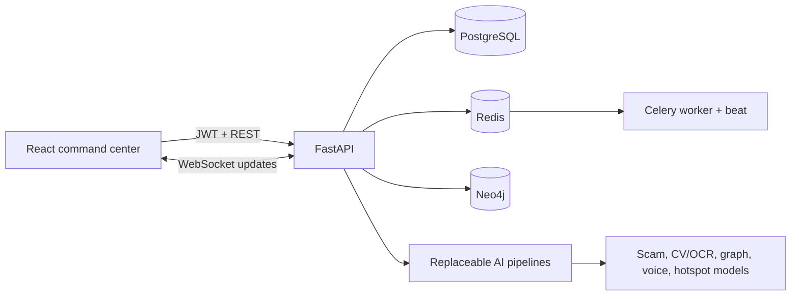

# SentinelX

SentinelX is an AI-powered Digital Public Safety Intelligence Platform for citizens, police, banks, telecom providers, and administrators. It combines fraud reporting, explainable scam detection, counterfeit-note inspection, network analysis, crime hotspot prediction, live dashboards, and a citizen safety assistant.

This repository is a hackathon prototype built entirely with synthetic data. It does not require or include proprietary government datasets.

## Architecture



## Features

- Role-aware dashboards for citizen, police, bank, telecom, and administrator users
- JWT access/refresh tokens with server-side revocation
- Explainable digital-arrest and scam-message detection
- Secure currency-image upload and counterfeit analysis
- NetworkX/Neo4j fraud graph intelligence
- GeoJSON crime heatmaps and hotspot prediction
- Citizen fraud assistant with text, image, audio, and PDF analysis
- Persistent predictions, alerts, audit logs, reports, and notifications
- Live dashboard/report/graph/heatmap WebSocket channels
- Redis/Celery background-task architecture
- Swagger, ReDoc, Prometheus metrics, health checks, structured logs, and request IDs

## Quick start with Docker

Requirements: Docker Engine with Compose v2.

```bash
cd backend
cp .env.example .env
docker compose up --build
```

Open:

- Frontend: `http://localhost:3000`
- Swagger: `http://localhost:8000/docs`
- ReDoc: `http://localhost:8000/redoc`
- Neo4j Browser: `http://localhost:7474`

With `DEMO_MODE=true`, startup applies migrations and creates demo accounts. All demo accounts use `SentinelX!2026`:

| Role | Email |
|---|---|
| Citizen | `citizen@sentinelx.demo` |
| Police | `police@sentinelx.demo` |
| Bank | `bank@sentinelx.demo` |
| Telecom | `telecom@sentinelx.demo` |
| Administrator | `admin@sentinelx.gov.in` |

Never enable demo mode or use these credentials in a public production deployment.

## Local development

Frontend:

```bash
npm ci
npm run dev
```

Backend:

```bash
cd backend
python3 -m venv .venv
source .venv/bin/activate
pip install -r requirements.txt
cp .env.example .env
alembic upgrade head
python -m scripts.seed
uvicorn app.main:app --reload
```

Set `VITE_API_URL=http://localhost:8000` when the API is not available at its default address.

## Environment

Key variables are documented in [`backend/.env.example`](backend/.env.example):

- `SECRET_KEY`: unique random value, minimum 32 characters in production
- `DATABASE_URL`: async SQLAlchemy PostgreSQL URL
- `REDIS_URL`: cache and Celery broker/backend
- `NEO4J_URI`, `NEO4J_USER`, `NEO4J_PASSWORD`
- `CORS_ORIGINS`: explicit frontend origins
- `STORAGE_PATH`, `MAX_UPLOAD_MB`
- `DEMO_MODE`: seed demo users; prohibited when `ENVIRONMENT=production`

## Tests and quality checks

```bash
npm test
npm run build
cd backend && .venv/bin/pytest -q
```

The suites cover authentication, token revocation, RBAC, report CRUD, AI contracts, prediction persistence, synthetic-data determinism, protected routes, API error handling, and upload signature validation.

## Repository layout

```text
src/                    React UI, auth, API client, hooks and tests
docker/                 Frontend image and Nginx reverse proxy
backend/app/            FastAPI domain application
backend/ai/             AI pipelines, training, artifacts and datasets
backend/alembic/        Database migrations
backend/tests/          Backend API/security tests
backend/scripts/        Startup and idempotent demo seeding
```

## Security and deployment

- TLS must terminate at the production ingress.
- Keep PostgreSQL, Redis, and Neo4j on private networks.
- Use managed secrets rather than committing `.env`.
- Disable `DEMO_MODE`, rotate `SECRET_KEY`, restrict CORS, and replace demo credentials.
- Move uploads to encrypted object storage with malware scanning.
- Replace the in-process WebSocket hub with Redis pub/sub when horizontally scaling.
- Use real SMS/email providers only after consent, privacy, and retention review.

## API and AI documentation

- Backend guide: [`backend/README.md`](backend/README.md)
- AI module guide: [`backend/ai/README.md`](backend/ai/README.md)
- Review report: [`CODE_REVIEW.md`](CODE_REVIEW.md)

## Future scope

Production model calibration, multilingual Indic speech evaluation, real provider integrations, PostGIS clustering, Redis-backed distributed WebSockets, model monitoring, encrypted evidence storage, and deployment-specific compliance controls.
